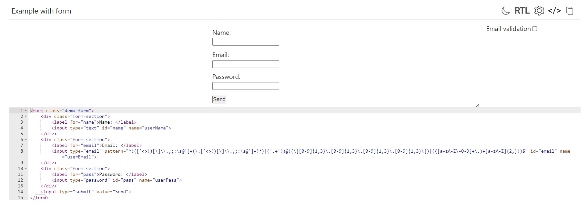

# UIPlayground

<p align="center">
  
</p>

<br/>

[](https://www.npmjs.com/package/@exadel/ui-playground)
[](https://github.com/exadel-inc/ui-playground/releases/latest)
[](https://github.com/exadel-inc/ui-playground/actions/workflows/lint.yml)
[](./README.md)

**UIPlayground** is a solution for presenting your custom components.

With the help of *UIP* components we allow user to *'play'* with a component.
You can choose from the variety of component's templates ([UIP Snippets](src/plugins/header/snippets/README.md)),
play with the component's settings ([UIP Settings](src/plugins/settings/README.md))
or even change its markup ([UIP Editor](src/plugins/editor/README.md))!
You can also manage Playground visual appearance by our options ([UIP Options](src/plugins/header/options/README.md))

Every element (except the *UIP Root*) isn't required, so you can combine them the way you want.


<br/>
---
## Installation

Install UIPlayground [npm dependency](https://www.npmjs.com/package/@exadel/ui-playground):
   ```bash
   npm i @exadel/ui-playground --save
   ```

---
## UIP elements:
- ### Core
  - #### [UIP Plugin](src/core/base/README.md#uip-plugin)
  - #### [UIP Root](src/core/base/README.md#uip-root)
  - #### [UIP State Model](src/core/base/README.md#uip-state-model)
- ### Components
  - #### [UIP Preview](src/core/preview/README.md)
  - #### [UIP Editor](src/plugins/editor/README.md)
  - #### [UIP Header](src/plugins/header/README.md)
    - ##### [UIP Snippets](src/plugins/header/snippets/README.md)
    - ##### [UIP Options](src/plugins/header/options/README.md)
  - #### [UIP Settings](src/plugins/settings/README.md)
    - ##### [UIP Setting](src/settings/setting/README.md)
    - ##### [UIP Text Setting](src/settings/text-setting/README.md)
    - ##### [UIP Bool Setting](src/settings/bool-setting/README.md)
    - ##### [UIP Select Setting](src/settings/select-setting/README.md)
---
## Example:
```html
<uip-root settings-collapsed>
  <uip-header>
    <uip-snippets></uip-snippets>
    <uip-options hide-theme hide-direction></uip-options>
  </uip-header>
  <script type="text/html" uip-snippet label="Example with form">
    <form class="demo-form">
      <div class="form-section">
        <label for="name">Name: </label>
        <input type="text" id="name" name="userName">
      </div>
      <div class="form-section">
        <label for="email">Email: </label>
        <input type="email"
               id="email" name="userEmail">
      </div>
      <div class="form-section">
        <label for="pass">Password: </label>
        <input type="password" id="pass" name="userPass">
      </div>
      <input type="submit" value="Send">
    </form>
  </script>
  <uip-preview class="centered-content" resizable></uip-preview>
  <uip-settings target=".demo-form">
    <uip-bool-setting label="Email validation" target="#email" mode="append" attribute="class"
                      value="validation-input"></uip-bool-setting>
    <uip-select-setting label="Form color:" attribute="class" mode="append">
      <option value="red">Red</option>
      <option value="aqua">Aqua</option>
      <option value="green">Green</option>
    </uip-select-setting>
    <uip-slider-setting label="Input width:" target="#name" attribute="test" min="300" max="1000"></uip-slider-setting>
    <uip-text-setting label="Input name:" terget="#email" attribute="pattern"></uip-text-setting>
  </uip-settings>
  <uip-editor></uip-editor>
</uip-root>
```

---

## Roadmap

- Integration with [ESL](https://github.com/exadel-inc/esl): demo pages
- Ability to control the width of Setting section
- Documentation and more demo content
- Css and JS support for Editor
- Readonly mode for Editor

---

## License

Distributed under the MIT License. See [LICENSE](https://github.com/exadel-inc/ui-playground/blob/HEAD/CLA.md)
for more information.

---

**Exadel, Inc.**

[](https://exadel.com)
