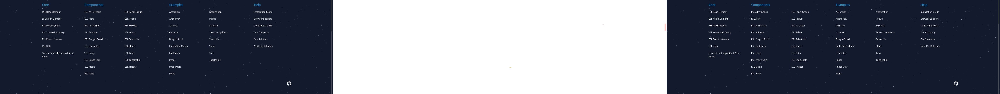

# Test Results
  ## Summary
  
| :clock10: Start time | :hourglass: Duration |
| --- | ---: |
|2/14/2025, 6:17:03 PM|20.35s|

| | :white_check_mark: Passed | :x: Failed | :construction: Todo | :white_circle: Total |
| --- | ---: | ---: | ---:| ---: |
|Test Suites|2|1|-|3|
|Tests|7|1|0|8|

  ---
  ## Tests Details
  ### tests/homepage.copyright.test.ts
<table>
<tr><th>Test</th><th>Status</th><th>Time</th></tr>
<tr><td>Homepage footer manual validation: Check if the footer copyright contains correct version</td><td>:white_check_mark:</td><td>33ms</td></tr>
<tr><td>Homepage footer manual validation: Check if the footer coypright contains correct year</td><td>:white_check_mark:</td><td>4ms</td></tr>
</table>

### tests/test.feature
<table>
<tr><th>Test</th><th>Status</th><th>Time</th></tr>
<tr><td>Feature: Test page looks fine: test page screen</td><td>:white_check_mark:</td><td>3.233s</td></tr>
</table>

### tests/homepage.feature
<table>
<tr><th>Test</th><th>Status</th><th>Time</th></tr>
<tr><td>Feature: Homepage looks fine: test homepage screen</td><td>:white_check_mark:</td><td>3.655s</td></tr>
<tr><td>Feature: Homepage looks fine: test homepage screen on mobile</td><td>:white_check_mark:</td><td>2.841s</td></tr>
<tr><td>Feature: Homepage looks fine: test homepage hamburger menu on mobile</td><td>:white_check_mark:</td><td>3.311s</td></tr>
<tr><td>Feature: Homepage looks fine: test homepage footer on desktop</td><td>:x:</td><td>2.987s</td></tr>
<tr><td colspan="3"></td></tr><tr><td>Feature: Homepage looks fine: test homepage footer on mobile</td><td>:white_check_mark:</td><td>2.276s</td></tr>
</table>

