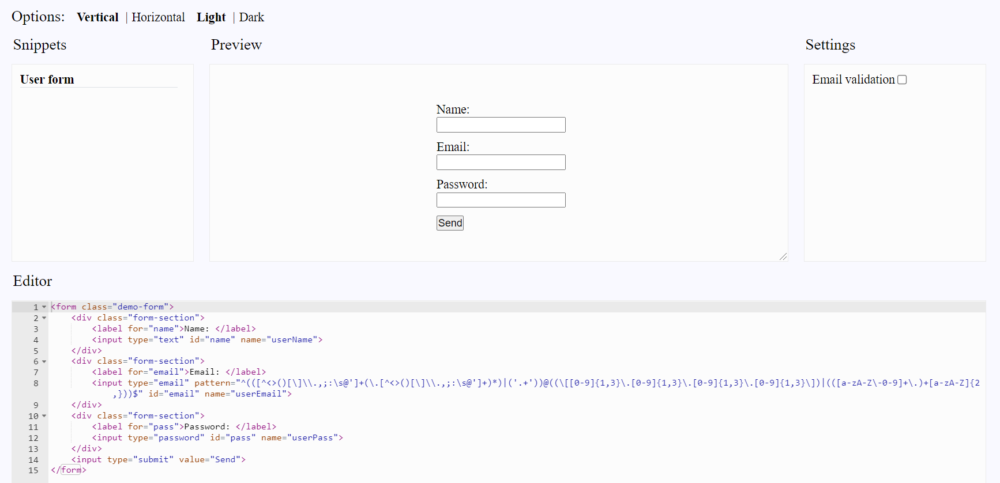

# UIPlayground

[](https://www.npmjs.com/package/@exadel/ui-playground)
[](https://github.com/exadel-inc/ui-playground/releases/latest)
[](https://github.com/exadel-inc/ui-playground/actions/workflows/lint.yml)
[](./README.md)

| **Note: Project is under development** |
| --- |

**UIPlayground** is a solution for presenting your custom components.

With the help of *UIP* components we allow user to *'play'* with a component.
You can choose from the variety of component's templates ([UIP Snippets](src/plugins/header/snippets/README.md)),
play with the component's settings ([UIP Settings](src/plugins/settings/README.md))
or even change its markup ([UIP Editor](src/plugins/editor/README.md))!

Every element (except the *UIP Root*) isn't required, so you can combine them the way you want.



---
## UIP elements:
- ### Core
  - #### [UIP Plugin](src/core/base/README.md#uip-plugin)
  - #### [UIP Root](src/core/base/README.md#uip-root)
  - #### [UIP State Model](src/core/base/README.md#uip-state-model)
- ### Components
  - #### [UIP Options](src/plugins/header/options/README.md)
  - #### [UIP Snippets](src/plugins/header/snippets/README.md)
  - #### [UIP Preview](src/core/preview/README.md)
  - #### [UIP Editor](src/plugins/editor/README.md)
  - #### [UIP Settings](src/plugins/settings/README.md)
    - ##### [UIP Setting](src/settings/setting/README.md)
    - ##### [UIP Text Setting](src/settings/text-setting/README.md)
    - ##### [UIP Bool Setting](src/settings/bool-setting/README.md)
    - ##### [UIP Select Setting](src/settings/select-setting/README.md)
---
## Example:
```html
<uip-root>
  <uip-options label="Options:"></uip-options>
  <uip-snippets label="Snippets">
    <template uip-snippet label="Users list">
      <div class="user-list">
        <div class="user-block aqua-user">Alexander</div>
        <div class="user-block aqua-user">Alexey</div>
        <div class="user-block aqua-user">Marina</div>
      </div>
    </template>
    <template uip-snippet label="Long users list" wrap-items>
      <div class="user-list">
        <div class="user-block red-user">Anton</div>
        <div class="user-block red-user">Dmitri</div>
        <div class="user-block red-user">Alexandra</div>
        <div class="user-block red-user">Artem</div>
        <div class="user-block red-user">Marina</div>
        <div class="user-block red-user">Alexander</div>
        <div class="user-block red-user">Alexander</div>
      </div>
    </template>
  </uip-snippets>
  <uip-preview label="Preview"></uip-preview>
  <uip-settings label="Settings" target=".user-list">
    <uip-select-setting label="User color" target=".user-block" attribute="class" mode="append">
      <option value="red-user">Red</option>
      <option value="aqua-user">Aqua</option>
      <option value="green-user">Green</option>
    </uip-select-setting>
    <uip-bool-setting label="Wrap items" attribute="wrap-items"></uip-bool-setting>
  </uip-settings>
  <uip-editor label="Editor"></uip-editor>
</uip-root>
```

---

## Roadmap

- Demo content
- Bugfixing
- Documentation
- Isolated content for preview

---

## License

Distributed under the MIT License. See [LICENSE](https://github.com/exadel-inc/ui-playground/blob/HEAD/CLA.md)
for more information.

---

**Exadel, Inc.**

[](https://exadel.com)
