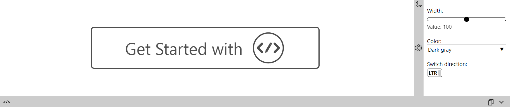

# UIPlayground

<p align="center">
  
</p>

<br/>

[](https://www.npmjs.com/package/@exadel/ui-playground)
[](https://github.com/exadel-inc/ui-playground/releases/latest)
[](https://github.com/exadel-inc/ui-playground/actions/workflows/lint.yml)
[](./README.md)

**UIPlayground** is a solution for presenting your custom components.

With the help of *UIP* components we allow user to *'play'* with a component.
You can choose from the variety of component's templates ([UIP Snippets](src/plugins/header/snippets/README.md)),
play with the component's settings ([UIP Settings](src/plugins/settings/README.md))
or even change its markup ([UIP Editor](src/plugins/editor/README.md))!
You can also manage Playground visual appearance by our options ([UIP Options](src/plugins/header/options/README.md))

Every element (except the *UIP Root*) isn't required, so you can combine them the way you want.

---
## Installation

Install UIPlayground [npm dependency](https://www.npmjs.com/package/@exadel/ui-playground)
   ```bash
   npm i @exadel/ui-playground --save
   ```
Run initialization function
   ```javascript
   import {init} from '@exadel/ui-playground/esm/registration.js';
   init();
   ```
Import CSS styles
   ```css
   @import "@exadel/ui-playground/esm/registration.css"
   ```

---
## UIP elements:
- ### Core
  - #### [UIP Plugin](src/core/base/README.md#uip-plugin)
  - #### [UIP Root](src/core/base/README.md#uip-root)
  - #### [UIP State Model](src/core/base/README.md#uip-state-model)
- ### Components
  - #### [UIP Preview](src/core/preview/README.md)
  - #### [UIP Editor](src/plugins/editor/README.md)
  - #### [UIP Header](src/plugins/header/README.md)
    - ##### [UIP Snippets](src/plugins/header/snippets/README.md)
    - ##### [UIP Options](src/plugins/header/options/README.md)
  - #### [UIP Settings](src/plugins/settings/README.md)
    - ##### [UIP Setting](src/settings/setting/README.md)
    - ##### [UIP Text Setting](src/settings/text-setting/README.md)
    - ##### [UIP Bool Setting](src/settings/bool-setting/README.md)
    - ##### [UIP Select Setting](src/settings/select-setting/README.md)
---
## Example



```html
<uip-root editor-collapsed>
  <uip-header>
    <uip-options></uip-options>
  </uip-header>
  <script type="text/html" uip-snippet label="Logo">
    <div class="logo-content gray-clr">
      <svg width="200" xmlns="http://www.w3.org/2000/svg" xmlns:xlink="http://www.w3.org/1999/xlink" fill="none" viewBox="0 0 47 46">
        <path fill-rule="evenodd" d="M23.244 0C10.402 0 0 10.28 0 22.97c0 12.692 10.402 22.971 23.244 22.971s23.244-10.28 23.244-22.97C46.488 10.279 36.086 0 23.244 0Zm0 44.218c-11.869 0-21.5-9.518-21.5-21.247 0-11.73 9.631-21.248 21.5-21.248s21.5 9.518 21.5 21.248c0 11.729-9.631 21.247-21.5 21.247ZM13.007 27.96l3.89-3.844a1.14 1.14 0 0 0 0-1.624 1.172 1.172 0 0 0-1.644 0l-4.303 4.252c-.08.08-.147.168-.199.262a1.139 1.139 0 0 0-.196 1.78l4.723 4.668c.454.448 1.19.448 1.644 0a1.139 1.139 0 0 0 0-1.625l-3.915-3.869Zm11.564-4.54 2.013 1.149-4.358 7.46-2.013-1.149 4.358-7.46Zm-2.49 8.857-2.013-1.148-.156 2.563 2.169-1.415Zm2.926-9.603a1.17 1.17 0 0 1 1.588-.42 1.14 1.14 0 0 1 .425 1.569l-.29.497-2.013-1.149.29-.497Zm10.945 6.109c-.061.06-.127.112-.196.156a1.15 1.15 0 0 1-.2.262l-4.302 4.253a1.172 1.172 0 0 1-1.644 0 1.139 1.139 0 0 1 0-1.625l3.89-3.844-3.915-3.869a1.14 1.14 0 0 1 0-1.624 1.172 1.172 0 0 1 1.644 0l4.723 4.667a1.139 1.139 0 0 1 0 1.624ZM22.297 6.698c.058-.057.12-.107.187-.15a1.172 1.172 0 0 1 1.637.007l3.65 3.606 1.871-1.85a.879.879 0 0 1 1.233 0c.34.337.34.882 0 1.218l-1.872 1.85 11.143 11.012a1.14 1.14 0 0 1 0 1.625 1.172 1.172 0 0 1-1.644 0L23.282 8.974 7.914 24.159a1.172 1.172 0 0 1-1.643 0 1.139 1.139 0 0 1 0-1.624L22.297 6.698Z" clip-rule="evenodd"/>
      </svg>
      <a class="get-started" href="{{ '/general/getting-started/' | url }}" data-test-msg="Get Started!"></a>
    </div>
  </script>
  <uip-preview></uip-preview>
  <uip-settings target=".logo-content">
    <uip-text-setting label="Alternative Button Text:" target=".get-started" attribute="data-test-msg"></uip-text-setting>
    <uip-slider-setting label="Width:" target=".logo-content svg" attribute="width" min="100" max="500"></uip-slider-setting>
    <uip-select-setting label="Color:" attribute="class" mode="append">
      <option value="gray-clr">Dark gray</option>
      <option value="blue-clr">Blue</option>
      <option value="purple-clr">Purple</option>
    </uip-select-setting>
  </uip-settings>
</uip-root>
```

---

## Roadmap

- Integration with [ESL](https://github.com/exadel-inc/esl): demo pages
- Ability to control the width of Setting section
- Documentation and more demo content
- Css and JS support for Editor
- Readonly mode for Editor

---

## License

Distributed under the MIT License. See [LICENSE](https://github.com/exadel-inc/ui-playground/blob/HEAD/CLA.md)
for more information.

---

**Exadel, Inc.**

[](https://exadel.com)
