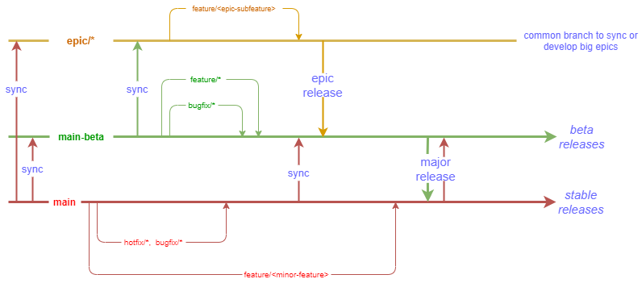

# ESL Release Branch Flow

ESL branches flow is described on the scheme below

- `main` - branch has an actual stable version of the library

- `main-beta` - branch for next major release ot the library

- `epic/*` (e.g `epic/new-big-feature`) - a branch for massive functionality or group of related features

- `feature/*` - a branch for a feature implementation

- `bugfix/*` - a branch for a bugfix implementation

The following merge flow can be provided by all team members:

- main -> main-beta
- main -> epic/*
- main-beta - epic/* (if epic is not going to be part of current stable major release)

The following process is a part of release processes and allowed for maintainers only

- main-beta -> main
- epic/* -> main
