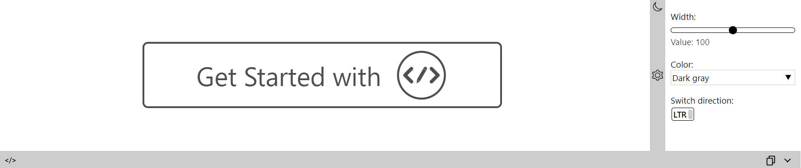

# UIPlayground

<p align="center">
  
</p>

<br/>

[](https://www.npmjs.com/package/@exadel/ui-playground)
[](https://github.com/exadel-inc/ui-playground/releases/latest)
[](https://github.com/exadel-inc/ui-playground/actions/workflows/lint.yml)
[](./README.md)

**UIPlayground** is a solution for presenting your custom components.

With the help of *UIP* components we allow user to *'play'* with a component.
You can choose from the variety of component's templates ([UIP Snippets](src/plugins/snippets-list/README.md)),
play with the component's settings ([UIP Settings](src/plugins/settings/README.md))
or even change its markup ([UIP Editor](src/plugins/editor/README.md))!

Every element (except the *UIP Root*) isn't required, so you can combine them the way you want.

---
## Installation

Install UIPlayground [npm dependency](https://www.npmjs.com/package/@exadel/ui-playground)
   ```bash
   npm i @exadel/ui-playground --save
   ```
Run initialization function
   ```javascript
   import {init} from '@exadel/ui-playground/esm/registration.js';
   init();
   ```
Import CSS styles
   ```css
   @import "@exadel/ui-playground/esm/registration.css";
   ```

---
## UIP elements

- ### Core
  - #### [UIP Root](src/core/README.md#uip-root)
  - #### [UIP Preview](src/core/README.md)
- ### Plugins
  - #### [UIP Editor](src/plugins/editor/README.md)
  - #### [UIP Settings and Setting](src/plugins/settings/README.md)
    - ##### [UIP Text Setting](src/plugins/settings/text-setting/README.md)
    - ##### [UIP Bool Setting](src/plugins/settings/bool-setting/README.md)
    - ##### [UIP Select Setting](src/plugins/settings/select-setting/README.md)
  - ##### [UIP Snippets](src/plugins/snippets/README.md)
    - ##### [UIP Snippets Title](src/plugins/snippets-title/README.md)
    - ##### [UIP Snippets List](src/plugins/snippets-list/README.md)
  - #### [UIP Theme Toggle](src/plugins/theme/README.md)
  - #### [UIP Note](src/plugins/note/README.md)
  - #### [UIP Copy](src/plugins/copy/README.md)
  - #### [UIP Text Direction Toggle](src/plugins/direction/README.md)
---
## Example



```html
<uip-root>
  <script type="text/html" uip-snippet label="Logo">
    <div class="logo-content gray-clr">
      <a class="get-started" href="{{ '/general/getting-started/' | url }}"><span>Get Started with</span>
        <div><svg width="100" xmlns="http://www.w3.org/2000/svg" fill="none" viewBox="0 0 268 268">
            <circle cx="135" cy="134" r="116" fill="none" stroke-width="10"/>
            <path d="M91.308 106.971 64.53 133.749l26.95 26.949a8 8 0 0 1-11.315 11.314l-32.508-32.509a8 8 0 0 1 0-11.313c.418-.418.87-.78 1.348-1.086a8.028 8.028 0 0 1 1.37-1.827l29.62-29.62a8 8 0 0 1 11.313 11.314ZM157.992 110.124l-13.856-8-30 51.962 13.856 8 30-51.962ZM113.136 155.818l13.856 8-14.928 9.856 1.072-17.856ZM158.064 94a8 8 0 0 0-10.928 2.928l-2 3.464 13.856 8 2-3.464A7.999 7.999 0 0 0 158.064 94ZM221.124 140.564a8 8 0 0 0 1.348-12.398l-32.509-32.51a8 8 0 0 0-11.314 11.315l26.95 26.949-26.778 26.778a8 8 0 0 0 11.313 11.314l29.621-29.62a8.007 8.007 0 0 0 1.369-1.828Z"/>
          </svg>
        </div>
      </a>
    </div>
  </script>
  <uip-preview class="fill center-alignment"></uip-preview>
  <uip-settings resizable collapsible vertical="@+sm" target=".logo-content" theme-toggle dir-toggle>
    <uip-slider-setting label="Width:" target=".logo-content svg" attribute="width" min="50" max="150"></uip-slider-setting>
    <uip-select-setting label="Color:" attribute="class" mode="append">
      <option value="gray-clr">Dark gray</option>
      <option value="blue-clr">Blue</option>
      <option value="purple-clr">Purple</option>
    </uip-select-setting>
  </uip-settings>
  <uip-editor collapsible copy></uip-editor>
</uip-root>
```

---

## Roadmap
- More demo content
- UIPNote: design improvement and technical support to store a note (any HTML content) associated with snippet
---

## License

Distributed under the MIT License. See [LICENSE](https://github.com/exadel-inc/ui-playground/blob/HEAD/CLA.md)
for more information.

---

**Exadel, Inc.**

[](https://exadel.com)
